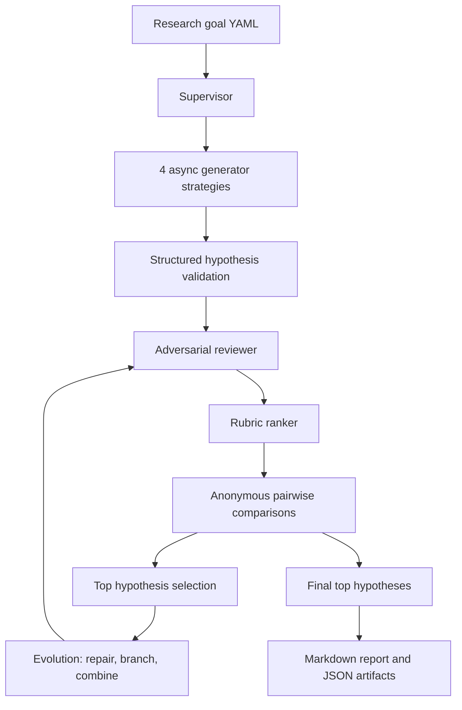
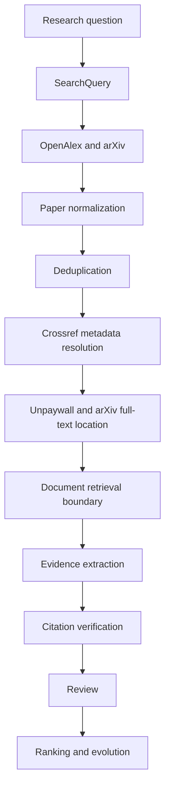

# Multi-Agent AI Co-Scientist MVP

This repository contains a local-first Python MVP for a multi-agent AI co-scientist workflow. It generates competing hypotheses, reviews and attempts to falsify them, ranks them with rubric and pairwise judgments, evolves the strongest candidates, and writes a Markdown report.

The default path is fully offline. Mock LLM outputs and mock literature records are deterministic synthetic data, not scientific claims.

## Architecture



Literature acquisition is an optional, separately gated pipeline:



OpenAlex and arXiv discover papers. Crossref resolves publication metadata. Unpaywall locates legal open-access copies. Finding a source is not the same as verifying a claim; citation verification still requires an exact passage.

## Providers

- `mock`: deterministic offline search, metadata, and full-text-location fixtures.
- `openalex`: searches OpenAlex works and normalizes work metadata.
- `crossref`: resolves DOI and bibliographic metadata, preserving field conflicts.
- `unpaywall`: locates legal open-access copies for DOI-bearing papers.
- `arxiv`: searches/parses arXiv Atom metadata and exposes canonical abstract/PDF locations.

Agents use provider-neutral abstractions: literature search, metadata resolution, full-text location, document retrieval, and citation verification remain separate concepts.

## Setup

Requires Python 3.11+.

```bash
python3 -m venv .venv
source .venv/bin/activate
python -m pip install -e ".[dev]"
```

## Offline Demo

No API key is required.

```bash
python -m coscientist.cli validate examples/demo_goal.yaml
python -m coscientist.cli run examples/demo_goal.yaml --provider mock
python -m coscientist.cli search-literature "linear magnetoresistance" --providers mock
```

## V1 Grounded Pilot Workflow

V1 adds a reproducible pilot-research and evaluation loop on top of the MVP. The MVP generates, reviews, ranks, evolves, and reports hypotheses. V1 adds a persistent project specification, fixture corpus, structured claim-level evidence links, deterministic citation/evidence verification, per-round evaluation, baseline-versus-evolved comparison, and a human-review package.

Run the deterministic offline pilot:

```bash
python -m coscientist.cli project-show research-projects/interdisciplinary_fixture/project.yaml
python -m coscientist.cli run-project research-projects/interdisciplinary_fixture/project.yaml --run-id urban-heat-pilot
python -m coscientist.cli validate-artifacts runs/urban-heat-pilot
python -m coscientist.cli verify-evidence runs/urban-heat-pilot
python -m coscientist.cli evaluate-run runs/urban-heat-pilot
python -m coscientist.cli compare-rounds runs/urban-heat-pilot
python -m coscientist.cli build-review-package runs/urban-heat-pilot
```

Important V1 artifacts:

- `run_manifest.json`: run mode, schema versions, and artifact list.
- `project_snapshot.json`: immutable project spec snapshot.
- `corpus.jsonl` and `normalized_papers.jsonl`: fixture paper corpus.
- `hypotheses_initial.jsonl`, `evolution_round_1.jsonl`, `evolution_round_2.jsonl`, `hypotheses_final.json`: evidence-linked hypotheses.
- `evidence_verification.jsonl`: claim-level verification records.
- `evaluation_by_round.json`: per-round rubric records.
- `round_comparison.json`: initial-versus-final comparison.
- `report.md`: pilot report.
- `human_review.md`: researcher-facing review package.

Interpret V1 scores as workflow diagnostics, not scientific truth. The evaluator is deterministic and useful for regression testing, but it can prefer its own rubric. Evidence verification checks fixture references, duplicate IDs, excerpts, unsupported claims, conflicts, and overstatement; it does not prove semantic truth.

The included pilot corpus is intentionally small and incomplete. Add another pilot by creating a project directory with `project.yaml`, `corpus.jsonl`, `rubric.yaml`, and a README, then run `run-project` against that spec.

## Live Network Opt-In

Live network access cannot happen accidentally. Any live provider command must include `--live-network`.

Environment variables:

- `OPENALEX_API_KEY`: required for live OpenAlex mode.
- `CROSSREF_MAILTO`: optional polite Crossref contact email.
- `UNPAYWALL_EMAIL`: required for live Unpaywall mode.
- `COSCIENTIST_USER_AGENT`: user agent for provider requests.
- `OPENAI_API_KEY`, `OPENAI_MODEL`, `OPENAI_BASE_URL`: only needed when intentionally using the OpenAI-compatible LLM provider.

Examples:

```bash
python -m coscientist.cli search-literature \
  "linear magnetoresistance in chromium selenide" \
  --providers openalex arxiv \
  --live-network

python -m coscientist.cli resolve-doi "10.xxxx/example" \
  --provider crossref \
  --live-network

python -m coscientist.cli locate-full-text "10.xxxx/example" \
  --providers unpaywall arxiv \
  --live-network

python -m coscientist.cli run examples/demo_goal.yaml \
  --provider mock \
  --literature-providers openalex arxiv \
  --metadata-resolver crossref \
  --full-text-locators unpaywall arxiv \
  --live-network
```

Provider-only commands do not require an LLM API key.

## Cache

Provider responses use a local cache at `.coscientist_cache/provider_responses` by default. Cache keys include provider, operation, normalized request, and API version. API keys, authorization headers, and contact emails are redacted from cache keys and request logs. Cache writes are atomic and corrupted cache files are ignored safely.

Configure cache behavior in `config/default.yaml`:

- `cache_enabled`
- `cache_ttl_hours`
- `force_refresh`
- `cache_dir`

## Persistence

Normal runs write JSON/JSONL artifacts under `runs/<run_id>/`. Literature-enabled runs also write:

- `provider_requests_round_0.jsonl`
- `papers_raw_round_0.json`
- `papers_normalized_round_0.json`
- `metadata_resolutions_round_0.json`
- `metadata_conflicts_round_0.json`
- `full_text_locations_round_0.json`
- `document_retrieval_round_0.json`
- `citations_round_0.json`
- `citation_verifications_round_0.json`
- `evidence_claims_round_0.json`

## Legal Retrieval Rules

Only retrieve documents from clearly authorized locations, such as arXiv public documents, Unpaywall-reported open-access locations, or explicitly configured local documents. The system does not bypass paywalls, authentication, robots restrictions, or access-control systems.

## Testing

Default tests are offline and deterministic:

```bash
pytest
```

Optional live smoke tests are excluded unless explicitly enabled:

```bash
RUN_LIVE_API_TESTS=1 pytest -m live
```

Live tests are intentionally small and should not assume stable result ordering.

## Limitations

- Provider search ranking is not scientific confidence.
- Metadata resolution is not full-text evidence.
- Open-access PDF availability is not proof that a claim is correct.
- Document retrieval and citation verification boundaries exist, but this MVP only persists unverified placeholders unless a retrieval/verifier implementation is added.
- No Semantic Scholar, PubMed, Europe PMC, graph database, vector database, frontend, OCR, browser automation, or paywall bypass.
- Resume support is minimal through saved phase artifacts and run state.

## Troubleshooting

- If a live command fails immediately, check `--live-network` and required environment variables.
- If OpenAlex fails before a request, set `OPENALEX_API_KEY`.
- If Unpaywall fails before a request, set `UNPAYWALL_EMAIL`.
- If Crossref throttles or rejects usage, set `CROSSREF_MAILTO` and reduce request volume.
- Delete `.coscientist_cache/provider_responses` or use `--force-refresh` on `run` if cached responses are stale.

## Next Planned Modules

- Passage-level document retrieval
- Citation verification against exact passages
- Richer V1/V2 semantic evidence verification
- Live-provider V1 project execution
- Proximity clustering
- Meta-review
- Benchmark evaluation
- Code execution sandbox
- Domain scientific tools
