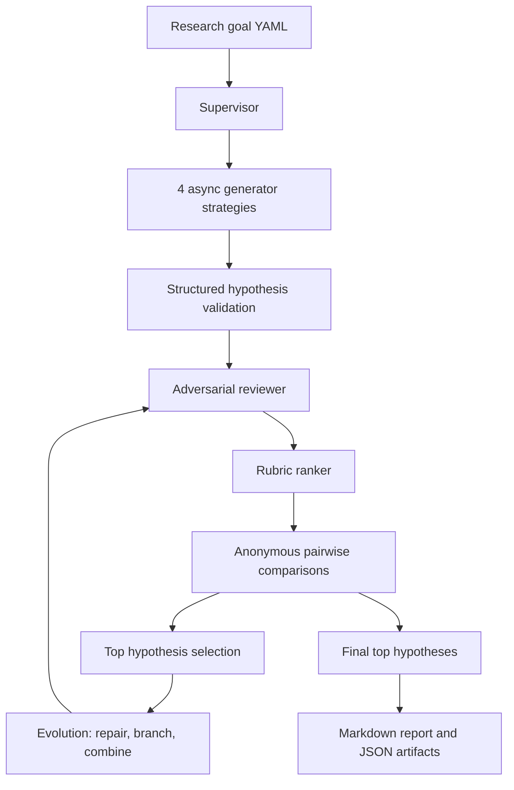
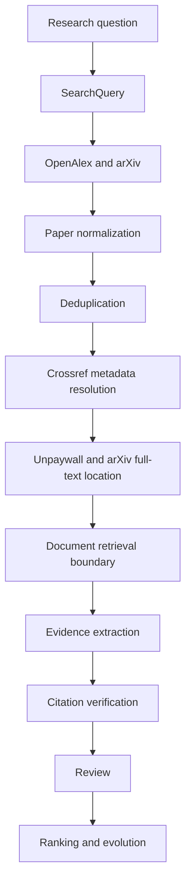
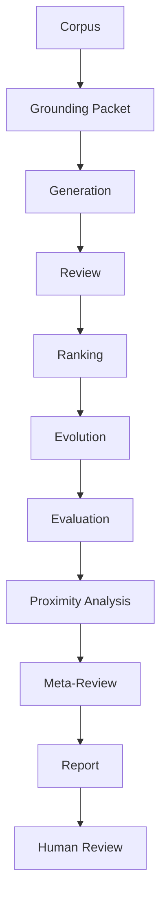
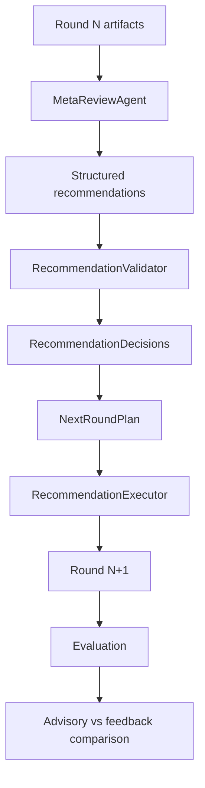
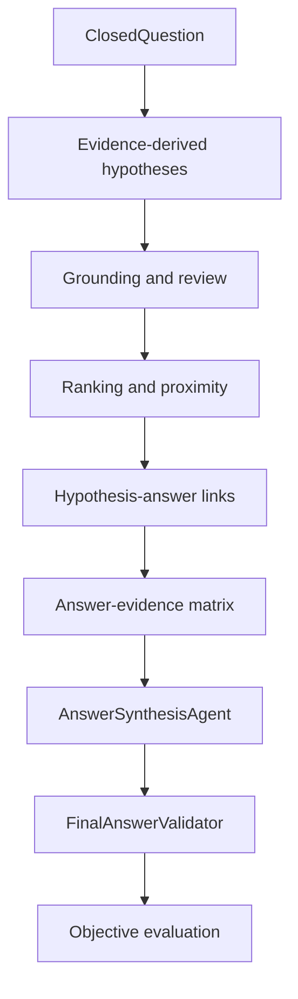
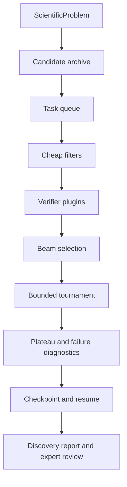
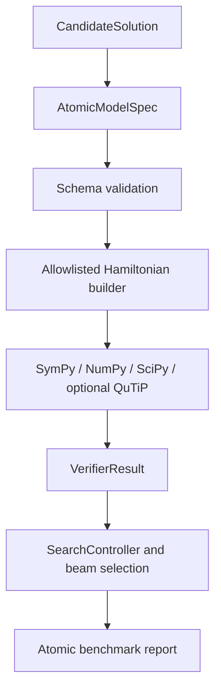

# Multi-Agent AI Co-Scientist MVP

This repository contains a local-first Python MVP for a multi-agent AI co-scientist workflow. It generates competing hypotheses, reviews and attempts to falsify them, ranks them with rubric and pairwise judgments, evolves the strongest candidates, and writes a Markdown report.

The default path is fully offline. Mock LLM outputs and mock literature records are deterministic synthetic data, not scientific claims.

## Architecture



Literature acquisition is an optional, separately gated pipeline:



OpenAlex and arXiv discover papers. Crossref resolves publication metadata. Unpaywall locates legal open-access copies. Finding a source is not the same as verifying a claim; citation verification still requires an exact passage.

V1.5B adds proximity, grounding, and meta-review artifacts:



V1.5C adds deterministic controlled-feedback evaluation:



Controlled feedback is disabled by default. Advisory mode persists recommendations and validation diagnostics but does not mutate the next round. Controlled-feedback mode must be explicitly enabled by project configuration or by the deterministic A/B runner's treatment branch, and only validated bounded actions can affect generation, targeted search requests, repair, branch, combine, or hold decisions. Feedback cannot enable live network/model access, change API credentials, or raise project budget ceilings.

## Providers

- `mock`: deterministic offline search, metadata, and full-text-location fixtures.
- `openalex`: searches OpenAlex works and normalizes work metadata. API keys are optional.
- `crossref`: resolves DOI and bibliographic metadata, preserving field conflicts. A contact email is optional and polite.
- `unpaywall`: locates legal open-access copies for DOI-bearing papers. Unpaywall requires an email for live enrichment.
- `arxiv`: searches/parses arXiv Atom metadata and exposes canonical abstract/PDF locations.

Agents use provider-neutral abstractions: literature search, metadata resolution, full-text location, document retrieval, and citation verification remain separate concepts.

## Setup

Requires Python 3.11+.

```bash
python3 -m venv .venv
source .venv/bin/activate
python -m pip install -e ".[dev]"
```

## Offline Demo

No API key is required.

```bash
python -m coscientist.cli validate examples/demo_goal.yaml
python -m coscientist.cli run examples/demo_goal.yaml --provider mock
python -m coscientist.cli search-literature "linear magnetoresistance" --providers mock
```

## V1 Grounded Pilot Workflow

V1 adds a reproducible pilot-research and evaluation loop on top of the MVP. The MVP generates, reviews, ranks, evolves, and reports hypotheses. V1 adds a persistent project specification, fixture corpus, structured claim-level evidence links, deterministic citation/evidence verification, per-round evaluation, baseline-versus-evolved comparison, and a human-review package.

Run the deterministic offline pilot:

```bash
python -m coscientist.cli project-show research-projects/interdisciplinary_fixture/project.yaml
python -m coscientist.cli run-project research-projects/interdisciplinary_fixture/project.yaml --run-id urban-heat-pilot
python -m coscientist.cli validate-artifacts runs/urban-heat-pilot
python -m coscientist.cli verify-evidence runs/urban-heat-pilot
python -m coscientist.cli evaluate-run runs/urban-heat-pilot
python -m coscientist.cli compare-rounds runs/urban-heat-pilot
python -m coscientist.cli build-review-package runs/urban-heat-pilot
```

Project literature modes:

- `fixture`: default deterministic JSONL corpus mode. No network calls.
- `existing`: resume from a saved normalized corpus JSONL with `--corpus`.
- `live`: use configured public scholarly providers, only with explicit `--live-network`.

Plan live acquisition without network calls:

```bash
python -m coscientist.cli acquire-literature \
  research-projects/interdisciplinary_fixture/project.yaml \
  --literature-mode live \
  --search-providers openalex arxiv \
  --enrichment-providers crossref unpaywall \
  --dry-run
```

Resume from an existing corpus:

```bash
python -m coscientist.cli run-project \
  research-projects/interdisciplinary_fixture/project.yaml \
  --corpus runs/some-prior-run/corpus.jsonl \
  --run-id resumed-pilot
```

Important V1 artifacts:

- `run_manifest.json`: run mode, schema versions, and artifact list.
- `project_snapshot.json`: immutable project spec snapshot.
- `resolved_configuration.json`: final project literature configuration after CLI overrides.
- `corpus.jsonl` and `normalized_papers.jsonl`: normalized paper corpus from fixture, existing, or live acquisition.
- `literature_queries.jsonl`: planned and executed provider-specific queries.
- `literature_search_events.jsonl`: provider request/cache event logs with secret-like fields redacted.
- `provider_status.json` and `provider_usage.json`: provider enablement, skips, request counts, cache hits, and failures.
- `raw_openalex_records.jsonl` and `raw_arxiv_records.jsonl`: raw or provider-normalized search records retained for audit.
- `crossref_enrichment.jsonl` and `unpaywall_enrichment.jsonl`: metadata and open-access enrichment outputs.
- `metadata_conflicts.jsonl`: unresolved metadata conflicts from deduplication or enrichment.
- `deduplication_report.json`: merge counts and conservative merge rationale.
- `corpus_manifest.json`: corpus hash, provider list, and acquisition limitations.
- `hypotheses_initial.jsonl`, `evolution_round_1.jsonl`, `evolution_round_2.jsonl`, `hypotheses_final.json`: evidence-linked hypotheses.
- `evidence_verification.jsonl`: claim-level verification records.
- `evaluation_by_round.json`: per-round rubric records.
- `round_comparison.json`: initial-versus-final comparison.
- `report.md`: pilot report.
- `human_review.md`: researcher-facing review package.

Interpret V1 scores as workflow diagnostics, not scientific truth. The evaluator is deterministic and useful for regression testing, but it can prefer its own rubric. Evidence verification checks fixture references, duplicate IDs, excerpts, unsupported claims, conflicts, and overstatement; it does not prove semantic truth.

The included pilot corpus is intentionally small and incomplete. Add another pilot by creating a project directory with `project.yaml`, `corpus.jsonl`, `rubric.yaml`, and a README, then run `run-project` against that spec.

## V1.5B And V1.5C Grounded Feedback

V1.5B artifacts describe the hypothesis landscape:

- `proximity_round_final.json`: pairwise similarity, clusters, graph nodes/edges, and search-space coverage.
- `clusters_round_final.json` and `hypothesis_graph_round_final.json`: machine-readable hypothesis landscape.
- `grounding_packets_round_final.json` and `grounding_diagnostics_round_final.json`: strict evidence context and grounding diagnostics.
- `meta_review_round_final.json` and `meta_review_decisions_round_final.json`: advisory meta-review recommendations and default-off feedback decision.
- `v15b_summary.json`: compact landscape/grounding/meta-review summary.

V1.5C artifacts evaluate whether controlled feedback changes the next round:

- `meta_review_recommendations_round_0.json`: bounded structured actions.
- `recommendation_decisions_round_0.json`: validator decisions and rejection reasons.
- `next_round_plan_round_1.json`: accepted actions normalized into a plan.
- `feedback_execution_round_1.json`: actual executor actions.
- `feedback_ab_manifest.json`: shared control/treatment baseline and permission guarantees.
- `feedback_ab_comparison.json`: diversity, grounding, quality-proxy, process, and cost metrics.
- `feedback_ab_summary.md`, `report.md`, and `human_review.md`: researcher-facing summaries and review questions.

Run the offline materials feedback comparison:

```bash
python -m coscientist.cli compare-feedback \
  examples/materials_synthesis_grounded_pilot/project.yaml \
  --runs-dir runs \
  --experiment-id materials-feedback-ab

python -m coscientist.cli validate-feedback-ab runs/materials-feedback-ab
```

The default comparison uses the mock provider, fixture or existing corpus, strict grounding, deterministic seed, no live network, and no live model. Outcome labels are bounded: `improved`, `mixed`, `no_material_change`, `regressed`, or `insufficient_evidence`. A controlled-feedback branch is not considered scientifically successful based on one metric alone.

## V1.6 Closed-Question Evaluation

V1.6 adds evidence-grounded closed scientific question answering for bounded answer spaces. Supported question types are `single_choice`, `multi_choice`, `ranking`, and `numeric`. Ground truth is stored only in evaluator artifacts and is never written into agent-visible question artifacts.



The default implementation is deterministic and token-efficient:

- no full run history is passed to answer synthesis;
- corpus context is compressed by evidence IDs and short excerpts;
- metadata-only records are removed from verified support;
- duplicate evidence and duplicate clusters are discounted;
- validation, exact-match scoring, aggregation, calibration, and artifact checks use deterministic code;
- model calls and token costs are recorded as zero/unavailable for offline mock runs instead of being fabricated.

Run the V1.6A deterministic benchmark:

```bash
PYTHONPATH=src python -m coscientist.cli run-closed-question \
  examples/closed_question_benchmark/project.yaml \
  --runs-dir runs \
  --run-id closed-demo \
  --force

PYTHONPATH=src python -m coscientist.cli evaluate-closed-question runs/closed-demo
PYTHONPATH=src python -m coscientist.cli validate-closed-question runs/closed-demo
```

Run advisory-versus-controlled-feedback comparison with final-answer metrics:

```bash
PYTHONPATH=src python -m coscientist.cli compare-closed-feedback \
  examples/closed_question_benchmark/project.yaml \
  --runs-dir runs \
  --experiment-id closed-feedback-ab \
  --force

PYTHONPATH=src python -m coscientist.cli validate-closed-question runs/closed-feedback-ab
```

Run the V1.6B offline CaFe4Al8 pilot:

```bash
PYTHONPATH=src python -m coscientist.cli run-closed-question \
  examples/cafe4al8_closed_pilot/project.yaml \
  --runs-dir runs \
  --run-id cafe4al8-closed \
  --force
```

The CaFe4Al8 pilot uses local existing-corpus records and explicitly labels user observations, local curation notes, and metadata-only placeholders. It does not claim that a synthesis mechanism is scientifically proven.

Optional future live-model command, not run by default:

```bash
PYTHONPATH=src python -m coscientist.cli run-project \
  examples/materials_synthesis_grounded_pilot/project.yaml \
  --provider openai \
  --live-model \
  --literature-mode existing \
  --corpus examples/cafe4al8_closed_pilot/corpus.jsonl \
  --max-model-calls 12 \
  --max-evolution-rounds 1 \
  --run-id cafe4al8-live-controlled
```

## V1.7 Scientific Discovery Search Runtime

V1.7 adds a deterministic search runtime for open-ended scientific discovery problems. It is not a new live agent stack. The runtime keeps the search local and bounded: it formalizes a problem, archives candidate solutions, runs cheap and standard verifier plugins, selects a verifier-weighted beam, performs bounded tournament comparisons, records plateau diagnostics, checkpoints state, and produces an expert-review package.



Default V1.7 projects use `model_mode: mock`, `literature_mode: fixture` or `existing`, `grounding_mode: strict`, zero model calls, and no network access. Verifiers are deterministic Python plugins and errors are isolated into verifier results instead of crashing the run.

Run the deterministic discovery fixture:

```bash
PYTHONPATH=src python -m coscientist.cli run-discovery \
  examples/discovery_search_fixture/project.yaml \
  --runs-dir runs \
  --run-id discovery-fixture \
  --force

PYTHONPATH=src python -m coscientist.cli validate-discovery runs/discovery-fixture
```

Test checkpoint and resume:

```bash
PYTHONPATH=src python -m coscientist.cli run-discovery \
  examples/discovery_search_fixture/project.yaml \
  --runs-dir runs \
  --run-id discovery-interrupted \
  --stop-after-tasks 2 \
  --force

PYTHONPATH=src python -m coscientist.cli resume-discovery \
  runs/discovery-interrupted/search_checkpoint.json
```

V1.7 artifacts include:

- `discovery_project.json` and `scientific_problem.json`: immutable project/problem snapshots.
- `problem_formalization.json`: normalized problem constraints and search-space summary.
- `candidate_archive.jsonl`: all candidates, scores, evidence links, status, lineage, and verifier-result links.
- `candidate_lineage_graph.json`: parent graph for cycle checks and resume.
- `candidate_status_history.jsonl`: status transitions with reasons.
- `candidate_failure_catalog.json`: cheap-filter and verifier failure categories.
- `search_tasks.jsonl`: task queue state, dependencies, budgets, and result artifacts.
- `verifier_results.jsonl`: deterministic verifier verdicts and checks.
- `beam_selection.json` and `tournament_comparisons.jsonl`: bounded search selection artifacts.
- `plateau_history.json`: score and lineage stagnation diagnostics.
- `search_checkpoint.json`: resumable queue/archive/verifier state with project and corpus hashes.
- `expert_review.md` and `expert_feedback.jsonl`: human-review prompts and persisted local feedback.
- `discovery_report.md` and `model_usage.json`: summary and zero-call budget accounting for offline runs.

The optional frontend facade is intentionally thin and backend-backed:

```bash
PYTHONPATH=src python -m coscientist.frontend
```

Import `coscientist.frontend.create_app()` to wire a local UI later without changing the discovery backend. The current facade supports loading a project, running a fixture, validating artifacts, and persisting expert feedback.

## V1.8 Atomic/AMO Verifier Pack And Workbench

V1.8 connects the V1.7 verifier protocol to trusted local scientific packages for a bounded Atomic/AMO pilot. The safety boundary is:



The system never executes arbitrary Python generated by a model. Atomic candidates use `structured_model.atomic_model` with strict schemas, allowlisted Hamiltonian terms, bounded dimensions, explicit units, and deterministic package-backed verifiers. Generic package output is evidence for encoded checks only; it does not prove a scientific model is uniquely correct.

Core backends:

- SymPy: symbolic Hermiticity and simple two-level identities.
- NumPy/SciPy: diagonalization, spectrum residuals, bounded parameter fitting, deterministic counterexample grid search.
- QuTiP: optional eigen/dynamics cross-checks when installed; otherwise verifier results are `inconclusive` with `qutip_unavailable`.
- ARC: interface deferred; no atomic-property values are fabricated.

Run the synthetic Atomic/AMO benchmark:

```bash
PYTHONPATH=src python -m coscientist.cli run-atomic-discovery \
  examples/atomic_spectroscopy_fixture/project.yaml \
  --runs-dir runs \
  --run-id atomic-demo \
  --force

PYTHONPATH=src python -m coscientist.cli validate-atomic-discovery runs/atomic-demo
```

Compare generic baselines against the atomic verifier pack:

```bash
PYTHONPATH=src python -m coscientist.cli compare-atomic-verifiers \
  examples/atomic_spectroscopy_fixture/project.yaml \
  --runs-dir runs \
  --experiment-id atomic-verifier-ab \
  --force
```

The benchmark contains three deterministic cases:

- Case A: recover a coupled two-level model from an avoided-crossing-like splitting.
- Case B: distinguish initially ambiguous three-level spectra using a field-discriminating transition set.
- Case C: demote a misleading complex model using held-out transition evidence and complexity penalty.

V1.8 artifacts include:

- `atomic_problem.json`
- `atomic_observations.json`
- `atomic_model_specs.jsonl`
- `symbolic_verification.jsonl`
- `numerical_verification.jsonl`
- `spectrum_assignments.jsonl`
- `selection_rule_results.jsonl`
- `qutip_verification.jsonl`
- `dynamics_summaries.jsonl`
- `parameter_fit_results.jsonl`
- `counterexample_search_results.jsonl`
- `atomic_candidate_equivalence.json`
- `atomic_benchmark_metrics.json`
- `atomic_benchmark_comparison.json`
- `atomic_benchmark_summary.md`
- `atomic_discovery_report.md`
- `atomic_expert_review.md`

Launch the backend-backed workbench facade:

```bash
PYTHONPATH=src python -m coscientist.frontend
```

If Gradio is installed through the optional UI extra, launch the workbench from Python:

```python
from coscientist.frontend import create_gradio_workbench

create_gradio_workbench().launch()
```

The workbench uses the same backend services as the CLI for project loading, deterministic atomic runs, validation, candidate tables, verifier inspection, reports, and appended expert feedback. Live model and live network modes remain disabled by default.

## V1.9 Real-Data Atomic Spectroscopy Campaign

V1.9 moves from synthetic Atomic/AMO fixtures to the first bounded real-data campaign protocol. The included pilot uses a local curated subset for `87Rb` D-line, hyperfine, and low-field Zeeman checks. It is offline and reproducible; it does not scrape or query public websites during tests or default runs.

Truth layers are separated:

- Agent-visible observations: train and validation observations, source limitations, uncertainties, and split rationale.
- Evaluator-only reference: hidden best-supported family and held-out test values.
- Human interpretation: reports and append-only expert feedback.

Run source curation only:

```bash
PYTHONPATH=src python -m coscientist.cli curate-atomic-campaign \
  examples/rb87_real_spectroscopy/project.yaml \
  --runs-dir runs \
  --run-id rb87-curation \
  --force
```

Run the full campaign:

```bash
PYTHONPATH=src python -m coscientist.cli run-atomic-campaign \
  examples/rb87_real_spectroscopy/project.yaml \
  --runs-dir runs \
  --run-id rb87-campaign \
  --force

PYTHONPATH=src python -m coscientist.cli validate-atomic-campaign runs/rb87-campaign
```

Compare deterministic campaign baselines:

```bash
PYTHONPATH=src python -m coscientist.cli compare-atomic-campaign \
  examples/rb87_real_spectroscopy/project.yaml \
  --runs-dir runs \
  --experiment-id rb87-campaign-baselines \
  --force
```

Campaign artifacts include:

- `source_manifest.json`, `source_snapshots.jsonl`
- `atomic_transitions_raw.jsonl`, `atomic_transitions_normalized.jsonl`
- `curation_decisions.jsonl`, `curation_conflicts.jsonl`
- `dataset_manifest.json`, `data_split_manifest.json`, `dataset_validation.json`
- `agent_visible_observations.jsonl`, `evaluator_only_reference.json`
- `candidate_family_templates.json`, `atomic_model_candidates.jsonl`
- `fit_results.jsonl`, `model_comparison.json`, `model_comparison_components.jsonl`
- `identifiability_results.jsonl`, `equivalence_classes.json`
- `held_out_predictions.jsonl`, `discriminating_observable_proposals.jsonl`
- `stress_test_results.jsonl`, `leave_one_observation_out.jsonl`, `source_sensitivity.json`
- `campaign_metrics.json`, `campaign_baseline_comparison.json`
- `campaign_report.md`, `campaign_expert_review.md`, `expert_feedback.jsonl`
- `open_problem_campaign_template.json`

Interpretation language is deliberately bounded: “best-supported within the tested candidate space”, “observationally equivalent under current data”, “not identifiable at current precision”, or “requires expert review.” V1.9 does not claim new Rb physics or full microscopic completeness.

## Live Network And Model Opt-In

Live network access cannot happen accidentally. Literature APIs and live LLMs use separate permissions.

- Literature APIs require `--live-network`.
- OpenAI-compatible model calls require `--provider openai --live-model`.
- Selecting `--provider openai` alone is rejected.
- API key presence alone never triggers a live model call.

Environment variables:

- `OPENALEX_API_KEY`: optional OpenAlex key.
- `CROSSREF_MAILTO`: optional polite Crossref contact email.
- `UNPAYWALL_EMAIL`: required for live Unpaywall mode.
- `COSCIENTIST_USER_AGENT`: user agent for provider requests.
- `OPENAI_API_KEY`, `OPENAI_MODEL`, `OPENAI_BASE_URL`: required only when intentionally using the OpenAI-compatible LLM provider.
- `OPENROUTER_APP_NAME`, `OPENROUTER_SITE_URL`: optional descriptive OpenRouter headers.

Examples:

```bash
python -m coscientist.cli search-literature \
  "linear magnetoresistance in chromium selenide" \
  --providers openalex arxiv \
  --live-network

python -m coscientist.cli resolve-doi "10.xxxx/example" \
  --provider crossref \
  --live-network

python -m coscientist.cli locate-full-text "10.xxxx/example" \
  --providers unpaywall arxiv \
  --live-network

python -m coscientist.cli run examples/demo_goal.yaml \
  --provider mock \
  --literature-providers openalex arxiv \
  --metadata-resolver crossref \
  --full-text-locators unpaywall arxiv \
  --live-network
```

Provider-only commands do not require an LLM API key.

For V1 project runs, use `acquire-literature --dry-run` first to inspect the query plan and budgets without network calls. Live project acquisition is bounded by `max_queries`, `max_results_per_query`, `max_total_results`, `max_total_requests`, and `max_requests_per_provider` in the project spec.

## V1.5A Live Model Runs

OpenRouter works through the OpenAI-compatible provider:

```dotenv
OPENAI_API_KEY=<your-openrouter-or-openai-key>
OPENAI_BASE_URL=https://openrouter.ai/api/v1
OPENAI_MODEL=<model-name>
OPENROUTER_APP_NAME=Multiagent AI Co-Scientist
OPENROUTER_SITE_URL=<optional-site-url>
```

Dry-run without model or literature calls:

```bash
python -m coscientist.cli run-project \
  research-projects/code_assistant_fixture/project.yaml \
  --provider openai \
  --live-model \
  --literature-mode fixture \
  --dry-run \
  --run-id code-assistant-live-dry-run
```

Connectivity smoke test, after explicit human approval:

```bash
python -m coscientist.cli run-project \
  research-projects/code_assistant_fixture/project.yaml \
  --provider openai \
  --live-model \
  --literature-mode fixture \
  --smoke \
  --run-id code-assistant-live-smoke
```

Mini live reasoning pilot, after smoke succeeds:

```bash
python -m coscientist.cli run-project \
  research-projects/code_assistant_fixture/project.yaml \
  --provider openai \
  --live-model \
  --literature-mode fixture \
  --max-model-calls 12 \
  --max-evolution-rounds 1 \
  --run-id code-assistant-live-mini
```

Do not combine first-time live literature debugging with first-time live model debugging. Start with `fixture` or `existing` corpus mode.

Live model project artifacts include:

- `model_calls.jsonl`: sanitized per-call metadata, schema status, retry count, usage when reported, finish reason, latency, and agent stage.
- `model_usage.json`: aggregate call count, token usage when reported, structured-output failures, and repair attempts.
- `model_provider_status.json`: provider mode, sanitized base URL host, requested model, and whether authentication was configured.

Structured outputs are parsed as JSON only. Fenced JSON can be extracted, Pydantic validation is enforced, and bounded repair attempts count against the model-call budget. API keys and authorization headers are never written to artifacts.

Compare a deterministic mock run against a live candidate:

```bash
python -m coscientist.cli compare-model-runs \
  runs/code-assistant-mock \
  runs/code-assistant-live-smoke
```

## V1.5B Proximity And Meta-Review

V1.5B runs remain offline and deterministic by default. They add:

- `ProximityAgent`: structured claim/mechanism/assumption/prediction/experiment/evidence/lineage similarity.
- `MetaReviewAgent`: artifact-aware process review with stopping assessment and next-round recommendations.
- `GroundingAgent`: bounded grounding packet and deterministic grounding diagnostics.
- Advisory feedback mode by default: recommendations are persisted but do not alter the next round.
- Controlled feedback mode: supported by schema and decision artifacts, but disabled unless project configuration explicitly enables it.

New artifacts:

- `proximity_round_final.json`
- `hypothesis_graph_round_final.json`
- `clusters_round_final.json`
- `search_space_coverage_round_final.json`
- `meta_review_round_final.json`
- `meta_review_decisions_round_final.json`
- `grounding_packets_round_final.json`
- `grounding_diagnostics_round_final.json`
- `v15b_summary.json`

Deterministic offline pilot:

```bash
PYTHONPATH=src python -m coscientist.cli run-project \
  research-projects/code_assistant_fixture/project.yaml \
  --run-id code-assistant-v15b

PYTHONPATH=src python -m coscientist.cli validate-artifacts runs/code-assistant-v15b
```

Materials-synthesis preparation pilot:

```bash
PYTHONPATH=src python -m coscientist.cli run-project \
  examples/materials_synthesis_grounded_pilot/project.yaml \
  --run-id materials-grounded-v15b
```

Grounding modes:

- `strict`: supported scientific claims must cite supplied evidence; metadata-only records cannot support claims.
- `permissive`: supplied evidence remains primary; unverified background must be labeled and cannot raise evidence scores.
- `off`: legacy behavior, clearly marked in artifacts.

Limitations: V1.5B uses deterministic lexical structured similarity, not embeddings. Meta-review is an artifact-aware decision aid, not scientific proof. UI and interactive graph rendering are deferred.

## Cache

Provider responses use a local cache at `.coscientist_cache/provider_responses` by default. Cache keys include provider, operation, normalized request, and API version. API keys, authorization headers, and contact emails are redacted from cache keys and request logs. Cache writes are atomic and corrupted cache files are ignored safely.

Configure cache behavior in `config/default.yaml`:

- `cache_enabled`
- `cache_ttl_hours`
- `force_refresh`
- `cache_dir`

## Persistence

Normal runs write JSON/JSONL artifacts under `runs/<run_id>/`. Literature-enabled runs also write:

- `provider_requests_round_0.jsonl`
- `papers_raw_round_0.json`
- `papers_normalized_round_0.json`
- `metadata_resolutions_round_0.json`
- `metadata_conflicts_round_0.json`
- `full_text_locations_round_0.json`
- `document_retrieval_round_0.json`
- `citations_round_0.json`
- `citation_verifications_round_0.json`
- `evidence_claims_round_0.json`

V1 project runs write `resolved_configuration.json`, `literature_queries.jsonl`, provider status/usage files, raw provider records, enrichment outputs, `deduplication_report.json`, and `corpus_manifest.json`. They also write `model_calls.jsonl`, `model_usage.json`, and `model_provider_status.json`. These files are enough to resume later with `--corpus runs/<run_id>/corpus.jsonl` without repeating provider calls.

## Legal Retrieval Rules

Only retrieve documents from clearly authorized locations, such as arXiv public documents, Unpaywall-reported open-access locations, or explicitly configured local documents. The system does not bypass paywalls, authentication, robots restrictions, or access-control systems.

## V2 Search OS Upgrades

The discovery runtime now includes optional, offline V2 support infrastructure:

- budget-limited Elo or Bradley-Terry tournament ranking;
- adaptive compute allocation by strategy, lineage, verifier stage, and model role;
- provider-neutral per-role model routing with deterministic mock fallback;
- independent reproduction checks for top candidates;
- artifact-backed workbench views for candidates, tournament state, budgets, verifiers, reproduction, tasks, checkpoints, claims, predictions, and expert feedback.

Defaults remain deterministic and offline. Existing V1 through V1.9 workflows continue to run without enabling the new tournament mode.

Example:

```bash
PYTHONPATH=src python -m coscientist.cli run-discovery \
  examples/discovery_search_fixture/project.yaml \
  --run-id discovery-v20 \
  --force

PYTHONPATH=src python -m coscientist.cli validate-discovery runs/discovery-v20
```

See `docs/v20_search_upgrades.md` for configuration details and artifact names.

## V2.1 Superconductivity Campaign

The repository now includes a bounded, offline superconductivity domain pack for the mixed BCS / correlated-hopping question. It adds local fixture adapters, a rebuildable SQLite artifact index, strict superconductivity model schemas, toy mean-field calculations, energy decomposition, optical cutoff warnings, doping sweeps, material mapping, identifiability, counterexamples, differentiated scores, and frontend views.

Run:

```bash
PYTHONPATH=src python -m coscientist.cli run-superconductivity-campaign \
  examples/superconductivity_bcs_campaign/project.yaml \
  --run-id superconductivity-v21 \
  --force

PYTHONPATH=src python -m coscientist.cli validate-superconductivity-campaign \
  runs/superconductivity-v21
```

Query the optional index:

```bash
PYTHONPATH=src python -m coscientist.cli query-index \
  runs/superconductivity-v21 materials --limit 5
```

This campaign is a bounded toy-model and curation framework. It does not prove a universal superconductivity mechanism or replace expert review. See `docs/v21_superconductivity_campaign.md`.

## V2.2 Theory-Discrimination Campaign

V2.2 adds a bounded superconductivity theory-discrimination campaign with provider-neutral per-role routing, live-agent dialogue artifacts, public database connection status, material-family selection, an expert-curated fixture dossier, microscopic Hamiltonian/derivation artifacts, mechanism fingerprints, parameter plausibility, adversarial tests, independent reproduction, and an experiment-level proposal.

Offline deterministic run:

```bash
PYTHONPATH=src python -m coscientist.cli run-v22-campaign \
  examples/v22_superconductivity_real_data/project.yaml \
  --run-id v22-fixture \
  --force

PYTHONPATH=src python -m coscientist.cli validate-v22-campaign runs/v22-fixture
```

Bounded live database smoke, only when explicitly allowed:

```bash
PYTHONPATH=src python -m coscientist.cli test-data-connections --live-network \
  --run-id v22-data-live \
  --force
```

Bounded live model smoke, only when explicitly allowed and credentials are configured:

```bash
PYTHONPATH=src python -m coscientist.cli test-live-models --live-model \
  --run-id v22-model-live \
  --force
```

V2.2 does not claim a discovery. It can produce constraints, equivalence classes, objections, and experiment proposals; public claims remain blocked behind expert review. See `docs/v22_superconductivity_theory_discrimination.md`.

## Phase 2 LSCO Data Acquisition

The Phase 2 LSCO workflow has a dedicated `Phase2DataAcquisitionAgent` for staged experimental-data acquisition. It searches or registers candidate sources, classifies observable coverage, extracts deterministic fixture table values, queues figure-only optical data for digitization, writes candidate rows to staging, applies promotion gates, reruns coverage, and reports whether model comparison is scientifically permitted.

The extraction and curation layer also includes a conservative observable ontology, sample/doping metadata, text/TeX parser hooks, supplementary CSV/ZIP parsing, review decisions, reviewed promotion, data-claim linkage, adversarial readiness gates, and comparison-robustness artifacts. See `docs/phase2_live_extraction_readiness_layer.md`.

Fixture mode is deterministic and uses no network:

```bash
PYTHONPATH=src python -m coscientist.cli phase2-acquire \
  --mode fixture \
  --runs-dir runs \
  --run-id phase2-lsco-fixture
```

Live mode requires explicit network permission and does not fall back to fixtures:

```bash
PYTHONPATH=src python -m coscientist.cli phase2-acquire \
  --mode live \
  --live-network \
  --max-queries 3 \
  --max-results-per-query 5 \
  --run-id phase2-lsco-live-smoke
```

Review staged rows and digitization tasks:

```bash
PYTHONPATH=src python -m coscientist.cli phase2-review-staging runs/phase2-lsco-fixture
PYTHONPATH=src python -m coscientist.cli phase2-digitization-queue runs/phase2-lsco-fixture
```

Review and promote an approved row into a canonical dataset copy:

```bash
PYTHONPATH=src python -m coscientist.cli phase2-review-row runs/phase2-lsco-fixture \
  --candidate-row-id <candidate-row-id> \
  --decision approve \
  --rationale "reviewed table provenance"

PYTHONPATH=src python -m coscientist.cli phase2-promote-reviewed runs/phase2-lsco-fixture \
  --canonical-dataset data/phase2_lsco.csv
```

Canonical `data/phase2_lsco.csv` is not modified unless promotion is explicitly enabled and deterministic gates pass. Figure-only optical values remain review-gated.

## Domain Packs and Hypothesis Optimizer V2

The platform now has a domain-independent checkpoint layer:

- `DomainPack` protocol for domain-specific ontology, queries, validators, tools, gates, benchmarks, and guardrails.
- `ScientificTaskType` policies for theory, data extraction, material comparison, phase identification, experiment selection, numerical modeling, and hidden-answer benchmarks.
- `HypothesisV2` migration layer.
- `HypothesisOptimizerV2` with hard gates, cheap kill tests, score provenance, Pareto portfolio, mutation operators, counterexample tasks, expected-information-gain actions, and failure memory.

List and inspect packs:

```bash
PYTHONPATH=src python -m coscientist.cli domains-list
PYTHONPATH=src python -m coscientist.cli domains-inspect --domain superconductivity_lsco
```

Run generic fixture acquisition:

```bash
PYTHONPATH=src python -m coscientist.cli acquisition-run \
  --domain magnetic_transport_crse \
  --question "CrSe magnetic transport AHE guardrail" \
  --runs-dir runs \
  --run-id crse-fixture \
  --force
```

Run Optimizer V2:

```bash
PYTHONPATH=src python -m coscientist.cli hypotheses-optimize \
  --domain superconductivity_lsco \
  --runs-dir runs \
  --run-id optimizer-v2-demo \
  --force
```

Run a deterministic DomainPack benchmark smoke:

```bash
PYTHONPATH=src python -m coscientist.cli benchmark-run \
  --domain xrd_phase_identification \
  --runs-dir runs \
  --run-id xrd-pack-smoke \
  --force
```

The Gradio workbench includes a `Domain Packs / Optimizer V2` tab. Live Agent Meeting also receives Optimizer V2 artifacts in its round-zero tool context, so agents are instructed to advance queued verifier/data/repair actions instead of restating generic future work.

See:

- `docs/domain_pack_protocol.md`
- `docs/hypothesis_optimizer_v2.md`
- `docs/platform_generalization_and_optimizer_v2_plan.md`

## Testing

Default tests are offline and deterministic:

```bash
pytest
```

Optional live smoke tests are excluded unless explicitly enabled:

```bash
RUN_LIVE_API_TESTS=1 pytest -m live
```

Live tests are intentionally small and should not assume stable result ordering.

## Limitations

- Provider search ranking is not scientific confidence.
- Metadata resolution is not full-text evidence.
- Open-access PDF availability is not proof that a claim is correct.
- Document retrieval and citation verification boundaries exist, but this MVP only persists unverified placeholders unless a retrieval/verifier implementation is added.
- No Semantic Scholar, PubMed, Europe PMC, graph database, vector database, frontend, OCR, browser automation, or paywall bypass.
- Resume support is minimal through saved phase artifacts and run state.

## Troubleshooting

- If a live command fails immediately, check `--live-network` and required environment variables.
- If OpenAlex returns throttling or policy errors, reduce request volume or set an optional `OPENALEX_API_KEY`.
- If Unpaywall fails before a request, set `UNPAYWALL_EMAIL`.
- If Crossref throttles or rejects usage, set `CROSSREF_MAILTO` and reduce request volume.
- Delete `.coscientist_cache/provider_responses` or use `--force-refresh` on `run` if cached responses are stale.

## Next Planned Modules

- Passage-level document retrieval
- Citation verification against exact passages
- Richer V1/V2 semantic evidence verification
- Live-provider V1 project execution
- Proximity clustering
- Meta-review
- Benchmark evaluation
- Code execution sandbox
- Domain scientific tools
