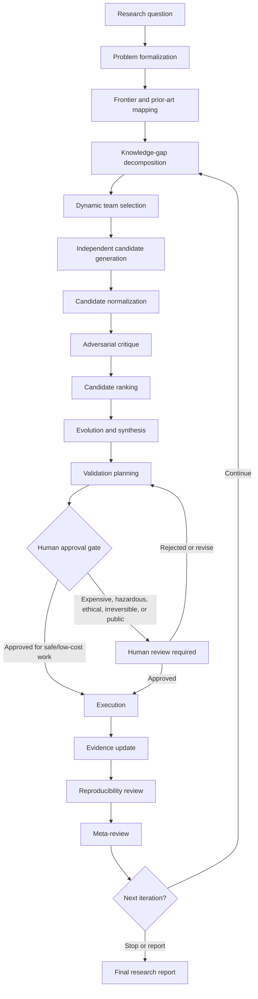

# General Multi-Agent Research Workflow

**Purpose:** Define a reusable workflow for multi-agent research on open-ended scientific, mathematical, engineering, and computational problems.

**Status:** Living document.

**Last updated:** 2026-06-22.

This workflow should evolve as the system is tested on real research projects. It is a guide for future development and scientific work, not a claim that every capability described here is already implemented in the repository.

Current V1 implementation note: project runs now support a bounded scholarly literature acquisition layer with fixture, existing-corpus, and explicit live-network modes. OpenAlex/arXiv search, Crossref metadata enrichment, Unpaywall open-access enrichment, query plans, raw provider records, deduplication reports, and corpus manifests are persisted as auditable artifacts.

Current V1.5A implementation note: project runs can use an explicitly gated OpenAI-compatible live model provider for smoke and bounded project runs while preserving mock as the default. Live model artifacts record sanitized model-call metadata, usage when reported by the provider, structured-output status, and repair attempts.

## 1. Scope

This workflow supports research tasks across physics, mathematics, chemistry, engineering, computer science, AI, and interdisciplinary science. It is intended for problems where the answer may be unknown, contested, difficult to validate, or dependent on domain-specific evidence.

The workflow supports objectives such as explanation, prediction, discovery, theorem proving or counterexample search, hypothesis generation, experimental design, computational modelling, engineering design, optimization, anomaly investigation, reproduction, and verification.

It does not guarantee discovery. It does not treat model output as ground truth. It cannot claim a theorem is proved without a valid proof. It cannot claim a scientific mechanism is established without sufficient evidence. It cannot replace human review for expensive, hazardous, ethical, irreversible, or high-stakes work.

## 2. Core Principles

| Principle | Operational meaning |
| --- | --- |
| Problem-first, not tool-first | Start from the research objective, constraints, and validation standard before choosing agents or tools. |
| Domain-adaptive teams | Select agents based on task type and domain; do not run every agent on every problem. |
| Competing candidates | Preserve multiple hypotheses, proofs, designs, or explanations instead of forcing premature consensus. |
| Evidence, inference, speculation | Keep observed facts, source interpretations, system reasoning, and guesses visibly separate. |
| Adversarial review | Require critics to search for failure modes, alternative explanations, hidden assumptions, and counterexamples. |
| Falsifiability and testability | Prefer candidates that make discriminating predictions or can be refuted by clear evidence. |
| Provenance tracking | Record sources, prompts when appropriate, data, code versions, model settings, and decision history. |
| Reproducibility | Preserve enough artifacts for another reviewer to repeat or audit the work. |
| Uncertainty reporting | Report confidence, limitations, unresolved assumptions, and contradictory evidence. |
| Negative results | Preserve failed attempts, refuted candidates, and null results because they constrain the search space. |
| Human decision gates | Require human approval for risky, costly, public, ethical, or irreversible steps. |
| Safety and ethics | Evaluate hazards, dual-use risks, privacy, consent, and environmental or social impact before execution. |
| No overclaiming | Rankings and model judgments are decision aids, not proof of truth. |

## 3. Research Problem Taxonomy

| Category | Goal | Typical outputs | Suitable validation methods |
| --- | --- | --- | --- |
| Explanation | Explain why a phenomenon occurs. | Mechanisms, causal models, conceptual maps. | Consistency checks, predictions, experiments, alternative explanation tests. |
| Prediction | Forecast an outcome under specified conditions. | Models, intervals, scenarios, benchmarks. | Held-out data, prospective tests, uncertainty calibration. |
| Discovery | Find new phenomena, relationships, materials, algorithms, or mechanisms. | Candidate discoveries, search plans, screening results. | Independent replication, novelty checks, targeted validation. |
| Proof | Prove, disprove, or refine a mathematical statement. | Proofs, proof sketches, lemmas, counterexamples. | Formal proof review, small-case checks, mechanized verification. |
| Design | Create a system, molecule, experiment, device, or algorithm. | Requirements, designs, trade studies, prototypes. | Simulation, prototype tests, verification against requirements. |
| Optimization | Improve an objective under constraints. | Pareto fronts, parameter sets, policies. | Baselines, ablations, robustness checks, cost accounting. |
| Identification | Infer an unknown model, cause, object, parameter, or structure. | Diagnoses, classifications, parameter estimates. | Discriminating tests, posterior checks, independent measurements. |
| Reproduction | Recreate a result or procedure. | Reproduction report, divergence log, environment record. | Exact reruns, independent implementation, data and environment audits. |
| Anomaly investigation | Explain an unexpected observation or failure. | Root-cause hypotheses, diagnostic tests, mitigations. | Controlled experiments, logs, stress tests, elimination of alternatives. |

## 4. Agent Roles

Use a modular agent registry. A project should activate only the roles needed for its task, domain, validation standard, and risk level.

### Core Roles

| Role | Responsibility | Inputs | Outputs | May modify code/data? | Must not claim or decide independently |
| --- | --- | --- | --- | --- | --- |
| Research Director | Coordinates stages, scope, budgets, and gates. | Research question, constraints, team registry. | Project plan, selected agents, gate decisions for human review. | No, unless explicitly acting as orchestrator for approved operations. | Cannot declare scientific success without validation and human review. |
| Problem Formalization Agent | Converts an informal question into precise tasks. | Intake notes, domain context, constraints. | Formal problem statement, assumptions, success criteria. | No. | Cannot narrow the problem in a way that hides user constraints. |
| Literature and Prior-Art Agent | Maps existing knowledge and identifies known results. | Search queries, domain terms, source tools. | Frontier map, source table, prior-art gaps. | No. | Cannot treat search results as verified evidence. |
| Hypothesis Generation Agent | Produces diverse candidate explanations or solutions. | Formal problem, constraints, prior-art map. | Candidate hypotheses, assumptions, predictions. | No. | Cannot claim generated candidates are correct. |
| Adversarial Critic | Searches for flaws, contradictions, and missing evidence. | Candidates, evidence, validation criteria. | Critiques, refutations, repair suggestions. | No. | Cannot reject a candidate solely because it is unfamiliar. |
| Ranking or Decision Agent | Scores and compares candidates using a rubric. | Candidates, critiques, evidence table, project goals. | Rankings, pairwise comparisons, disagreement notes. | No. | Cannot convert a ranking into objective truth. |
| Evolution or Synthesis Agent | Repairs, branches, or combines candidates. | Candidates, critiques, rankings. | Revised candidates, lineage records. | No. | Cannot overwrite parent candidates or hide failed branches. |
| Computational and Simulation Agent | Plans or runs approved computational checks. | Models, data, code, parameters. | Simulation plans, outputs, logs, reproducibility notes. | Yes, only in approved workspaces and within tool permissions. | Cannot treat simulation as reality without model validation. |
| Experimental Design Agent | Designs empirical tests and controls. | Hypotheses, available instruments, safety constraints. | Validation plans, control designs, measurement protocols. | No, except approved experiment metadata. | Cannot authorize hazardous or expensive execution. |
| Evidence and Statistics Agent | Evaluates evidence quality and uncertainty. | Data, claims, methods, source passages. | Evidence tables, uncertainty estimates, statistical critiques. | Yes, for approved analysis artifacts. | Cannot ignore negative results or data leakage. |
| Reproducibility Reviewer | Audits whether work can be repeated. | Code, data, environment, logs, methods. | Reproducibility report, missing artifact list. | No, except reproducibility notes. | Cannot certify results without sufficient artifacts. |
| Meta-Review Agent | Reviews the entire process for bias and overclaiming. | Stage outputs, decisions, critiques, evidence. | Meta-review, risk register, next-iteration recommendation. | No. | Cannot override mandatory human gates. |

### Optional Domain Specialists

| Role | Responsibility | Inputs | Outputs | May modify code/data? | Must not claim or decide independently |
| --- | --- | --- | --- | --- | --- |
| Theoretical Physics Agent | Checks mechanisms, limiting cases, symmetries, and laws. | Physics candidates, equations, assumptions. | Theoretical consistency review. | No. | Cannot establish empirical truth without evidence. |
| Experimental Physics Agent | Maps predictions to measurements and instruments. | Hypotheses, equipment constraints. | Measurement plan, controls, feasibility notes. | No. | Cannot approve hazardous execution. |
| Mathematical Reasoning Agent | Develops proofs, lemmas, and derivations. | Formal statements, known results. | Proof sketches, derivations, dependencies. | No. | Cannot call a proof complete without review. |
| Counterexample Search Agent | Searches for disproofs and edge cases. | Conjectures, definitions, constraints. | Counterexamples, small-case results, search logs. | Yes, for approved search scripts/data. | Cannot infer truth from failure to find a counterexample. |
| Formal Verification Agent | Encodes statements in proof assistants or verifiers. | Formalized statements, proof sketches. | Machine-checkable artifacts, verification status. | Yes, in approved proof/code files. | Cannot verify informal claims not encoded in the system. |
| Chemistry Mechanism Agent | Evaluates reaction mechanisms and plausibility. | Molecules, pathways, conditions. | Mechanism critique, competing pathways. | No. | Cannot claim safety or synthesizability without review. |
| Materials or Synthesis Agent | Proposes materials routes and characterization. | Candidate materials, constraints. | Synthesis plan, characterization plan, risk notes. | No. | Cannot authorize lab work. |
| Systems Engineering Agent | Manages requirements, interfaces, and trade-offs. | Requirements, constraints, stakeholder needs. | Requirements matrix, architecture options. | No. | Cannot waive safety or reliability requirements. |
| Hardware Agent | Evaluates devices, circuits, and physical constraints. | Hardware goals, schematics, constraints. | Hardware design review, test plan. | Yes, only approved design artifacts. | Cannot approve irreversible fabrication. |
| Software Agent | Implements or reviews software experiments. | Specifications, tests, repository context. | Code changes, tests, implementation notes. | Yes, within approved repository boundaries. | Cannot change scope or deploy without approval. |
| Controls Agent | Designs control policies and stability checks. | Plant model, constraints, objectives. | Controller candidates, stability analysis. | Yes, for approved simulation artifacts. | Cannot deploy to real hardware without a gate. |
| Reliability and Safety Agent | Identifies hazards and failure modes. | Designs, experiments, environment. | Risk register, mitigation plan, gate recommendations. | No. | Cannot hide low-probability high-impact risks. |
| Algorithm and Benchmark Agent | Designs AI/CS evaluations and baselines. | Algorithm candidates, datasets, metrics. | Benchmark plan, ablation plan, comparison table. | Yes, for approved code and data artifacts. | Cannot claim improvement without valid baselines. |

## 5. End-to-End Research Workflow

| Stage | Objective | Responsible agents | Required inputs | Main activities | Required outputs/artifacts | Completion gate | Common failure modes |
| --- | --- | --- | --- | --- | --- | --- | --- |
| 1. Research intake | Capture the user question and context. | Research Director | User request, constraints, available resources. | Record objective, domain, risk, timeline, resources. | `question.md`, intake summary. | User confirms the captured intent. | Ambiguous goal, missing constraints, hidden safety issue. |
| 2. Problem classification | Identify task type and validation standard. | Research Director, Problem Formalization Agent | Intake summary. | Classify as explanation, proof, design, etc.; identify domain branches. | Task taxonomy entry. | Classification is explicit and revisable. | Treating every task as literature search or coding. |
| 3. Problem formalization | Convert the task into precise questions. | Problem Formalization Agent, domain specialists | Classification, constraints. | Define terms, assumptions, variables, success/failure criteria. | Formal problem statement, constraints. | Human accepts scope and definitions. | Over-narrowing, vague terms, impossible success criteria. |
| 4. Frontier and prior-art mapping | Identify known results and gaps. | Literature and Prior-Art Agent, domain specialists | Search queries, formal problem. | Search, retrieve, cite, summarize, separate known facts from claims. | `frontier_map.md`, source table. | Sources are tracked and limitations noted. | Hallucinated citations, outdated sources, search bias. |
| 5. Knowledge-gap decomposition | Break the problem into subquestions. | Research Director, domain specialists | Formal problem, frontier map. | Identify unknowns, dependencies, discriminating tests. | Gap map, subtask list. | Subtasks map to validation methods. | Gaps too broad, duplicate tasks, missing critical assumptions. |
| 6. Dynamic team selection | Activate the right agents. | Research Director | Taxonomy, gap map, risk profile. | Choose core and specialist agents; set tool permissions. | Team plan, permission plan. | Team covers needed expertise and risks. | Too many agents, missing critic, excessive autonomy. |
| 7. Independent candidate generation | Produce diverse candidates. | Hypothesis Generation Agent, specialists | Formal problem, gap map, constraints. | Generate hypotheses, proofs, designs, models, or explanations independently. | Candidate set with assumptions. | Candidates are distinct and normalized enough to compare. | Superficial variants, premature consensus. |
| 8. Candidate normalization | Make candidates comparable. | Problem Formalization Agent, Research Director | Candidate set. | Standardize fields, lineage, assumptions, predictions. | Candidate records. | Every candidate has validation and falsification fields where applicable. | Lost nuance, hidden merged candidates. |
| 9. Adversarial critique | Find flaws and alternatives. | Adversarial Critic, Counterexample Search Agent, domain critics | Candidate records, evidence. | Attack assumptions, search counterexamples, identify missing evidence. | Critique records. | Major concerns are explicit. | Critic bias, rejecting novelty without evidence. |
| 10. Candidate ranking | Prioritize without collapsing diversity. | Ranking or Decision Agent, Evidence and Statistics Agent | Candidates, critiques, evidence. | Score on rubric, pairwise comparisons, preserve disagreement. | Ranking table, decision notes. | Multiple candidates retained unless clearly refuted. | Ranking bias, false precision. |
| 11. Evolution and synthesis | Improve candidates. | Evolution or Synthesis Agent, domain specialists | Ranked candidates, critiques. | Repair, branch, combine, document lineage. | Revised candidates, lineage graph. | Parents preserved and changes explained. | Overwriting history, combining incompatible ideas. |
| 12. Validation planning | Design tests. | Experimental Design Agent, Computational Agent, Evidence Agent | Candidate set, constraints. | Select tests, controls, variables, decision rules, resources. | `validation_plan.md`. | Human can understand cost, risk, and information gain. | Test does not discriminate, no controls. |
| 13. Human approval gate | Decide whether execution may proceed. | Human reviewer, Research Director, Safety Agent | Validation plan, risk register. | Review safety, ethics, cost, permissions, reversibility. | Approval, rejection, or revision decision. | Mandatory approval for risky/costly/public actions. | Unreviewed hazards, unclear approver. |
| 14. Execution | Run approved validation. | Computational Agent, Experimental Agent, Software Agent | Approved plan, resources. | Run simulations, experiments, proofs, benchmarks, or reproductions. | Raw outputs, logs, environment. | Execution matches approved plan or deviations are recorded. | Scope creep, unsafe actions, missing logs. |
| 15. Evidence update | Incorporate results. | Evidence and Statistics Agent, domain specialists | Raw results, source passages, logs. | Analyze data, update evidence table, mark uncertainty. | `evidence_table.md`, analysis notes. | Evidence is linked to claims and methods. | Selective reporting, p-hacking, data leakage. |
| 16. Reproducibility review | Audit repeatability. | Reproducibility Reviewer | Artifacts, code, data, environment. | Check seeds, versions, instructions, data availability. | Reproducibility report. | Another reviewer can repeat or identify blockers. | Missing environment, undocumented preprocessing. |
| 17. Meta-review | Review the process and claims. | Meta-Review Agent, Research Director | All artifacts. | Check overclaiming, bias, unresolved risk, next steps. | Meta-review, risk summary. | Claims are calibrated to evidence. | Inflated conclusions, ignored negative results. |
| 18. Final research report | Communicate results. | Research Director, domain specialists | Evidence table, rankings, validation results. | Separate facts, source interpretations, system inferences, speculation. | `final_report.md`. | Human accepts wording and limitations. | Treating ranking as proof, missing caveats. |
| 19. Next-iteration decision | Decide stop, continue, or redirect. | Human reviewer, Research Director | Final report, meta-review. | Evaluate information gain and remaining uncertainty. | Decision record. | Stop/continue criteria documented. | Continuing by inertia, stopping because agents produced text. |

## 6. Workflow Diagram



## 7. Dynamic Team-Selection Examples

| Problem type | Example team | Typical pipeline |
| --- | --- | --- |
| Mathematical conjecture | Research Director, Problem Formalization Agent, Mathematical Reasoning Agent, Counterexample Search Agent, Formal Verification Agent, Adversarial Critic, Meta-Review Agent. | Formalize definitions -> small-case checks -> proof sketches -> counterexample search -> lemma review -> formal verification when feasible -> proof report. |
| Unresolved physics mechanism | Research Director, Literature Agent, Theoretical Physics Agent, Experimental Physics Agent, Hypothesis Agent, Adversarial Critic, Evidence and Statistics Agent. | Map prior art -> generate mechanisms -> check laws and limiting cases -> derive predictions -> design discriminating experiments -> update evidence. |
| Chemistry or molecular design | Research Director, Chemistry Mechanism Agent, Materials or Synthesis Agent, Literature Agent, Computational Agent, Safety Agent, Experimental Design Agent. | Define target properties -> propose molecules/pathways -> check thermodynamics/kinetics -> compute candidates -> synthesis and safety review -> characterization plan. |
| Engineering system design | Research Director, Systems Engineering Agent, Hardware Agent, Software Agent, Controls Agent, Reliability and Safety Agent, Ranking Agent. | Capture requirements -> generate architectures -> trade study -> simulate -> failure-mode analysis -> prototype plan -> approval gate. |
| AI or algorithm research | Research Director, Algorithm and Benchmark Agent, Software Agent, Evidence and Statistics Agent, Reproducibility Reviewer, Adversarial Critic. | Define metric and baselines -> implement experiments -> ablations -> statistical analysis -> robustness checks -> reproducibility audit. |

## 8. Standard Research Artifacts

Recommended structure for future projects:

```text
research/
  projects/
    <project-id>/
      question.md
      constraints.md
      frontier_map.md
      evidence_table.md
      hypotheses/
      critiques/
      rankings/
      validation_plan.md
      experiments/
      simulations/
      decisions.md
      final_report.md
      provenance/
```

| Artifact | Contents |
| --- | --- |
| `question.md` | Original question, task type, scope, success criteria, falsification criteria. |
| `constraints.md` | Resources, safety limits, ethical constraints, deadlines, excluded methods. |
| `frontier_map.md` | Prior-art summary, known results, open gaps, source limitations. |
| `evidence_table.md` | Claims, evidence, source passages, confidence, conflicts, verification status. |
| `hypotheses/` | Candidate hypotheses, proof strategies, designs, models, or solutions with lineage. |
| `critiques/` | Adversarial reviews, counterexamples, missing evidence, suggested repairs. |
| `rankings/` | Rubric scores, pairwise comparisons, disagreements, decision notes. |
| `validation_plan.md` | Tests, controls, decision rules, resources, safety considerations. |
| `experiments/` | Experiment protocols, raw outputs, logs, deviations, analysis notes. |
| `simulations/` | Models, parameters, seeds, outputs, environment, limitations. |
| `decisions.md` | Human gates, alternatives, rationale, approvers, unresolved uncertainty. |
| `final_report.md` | Calibrated conclusions, evidence, limitations, next steps. |
| `provenance/` | Code versions, model settings, prompts when appropriate, retrieved documents, data lineage. |

This document recommends the structure; it does not require creating these directories before the repository has implementation support.

## 9. Standard Schemas and Templates

### Research Question

```markdown
## Research Question
- Question:
- Importance:
- Task type:
- Scope:
- Constraints:
- Available resources:
- Success criteria:
- Falsification criteria:
```

### Evidence Record

```markdown
## Evidence Record
- Claim:
- Evidence:
- Source:
- Evidence type:
- Confidence:
- Limitations:
- Conflicting evidence:
```

### Candidate Hypothesis or Solution

```markdown
## Candidate
- Name:
- Core idea:
- Assumptions:
- Mechanism or derivation:
- Predictions:
- Validation strategy:
- Supporting evidence:
- Counter-evidence:
- Weaknesses:
- Status:
```

### Critique

```markdown
## Critique
- Fatal flaws:
- Major concerns:
- Minor concerns:
- Missing evidence:
- Alternative explanations:
- Recommended revision:
```

### Validation Plan

```markdown
## Validation Plan
- Candidate being tested:
- Test type:
- Controls:
- Variables:
- Expected outcomes:
- Decision rule:
- Uncertainty:
- Resources:
- Safety considerations:
```

### Decision Record

```markdown
## Decision Record
- Decision:
- Alternatives considered:
- Evidence used:
- Rationale:
- Unresolved uncertainty:
- Approver:
- Date:
```

## 10. Evidence and Claim Levels

| Level | Meaning | Promotion rule |
| --- | --- | --- |
| Established fact | Widely verified or directly established in the current project. | Requires strong evidence and review. |
| Directly observed result | Measured or computed result from a recorded procedure. | Requires preserved raw output and method. |
| Strongly supported interpretation | Interpretation supported by multiple lines of evidence. | Requires evidence table and alternatives considered. |
| Tentative interpretation | Plausible interpretation with incomplete support. | Must keep uncertainty visible. |
| Inference | Reasoning step derived from evidence or assumptions. | Must cite premises. |
| Speculation | Idea without adequate evidence. | Must be labeled as speculative. |
| Numerical evidence | Computation, experiment, or statistical result. | Requires method, data, uncertainty, and reproducibility notes. |
| Proof sketch | Informal outline of a proof. | Cannot be treated as a proof. |
| Formal proof | Complete proof accepted by review or formal verification. | Requires proof artifact and review. |
| Refuted | Candidate contradicted by valid evidence or counterexample. | Preserve reason and evidence. |
| Inconclusive | Evidence does not decide the claim. | Record what would resolve it. |

The system must not silently promote a claim to a stronger level. Any promotion requires evidence, provenance, and review.

## 11. Candidate Ranking Framework

| Dimension | Question to ask |
| --- | --- |
| Correctness or plausibility | Is the candidate consistent with known constraints and domain rules? |
| Evidence support | What verified evidence supports it? |
| Novelty | Is it meaningfully distinct from prior art and other candidates? |
| Explanatory power | Does it explain more observations with fewer gaps? |
| Testability | Can it be tested with available or realistic methods? |
| Falsifiability | What result would refute it? |
| Feasibility | Can the validation or implementation be done with available resources? |
| Information gain | Would testing it substantially reduce uncertainty? |
| Robustness | Does it survive perturbations, edge cases, and alternative assumptions? |
| Impact | Would success matter scientifically, technically, or practically? |
| Cost and time | What resources are required? |
| Safety and ethics | What hazards, dual-use risks, or ethical concerns exist? |

Rankings are decision aids, not objective truth. Preserve multiple diverse candidates unless they are clearly refuted, unsafe, out of scope, or dominated by stronger alternatives.

## 12. Domain-Specific Validation Branches

### Mathematics

- Check small cases and boundary cases.
- Search for counterexamples.
- Verify lemmas independently.
- Review proof dependencies and hidden assumptions.
- Use formal verification when available and worthwhile.

### Physics

- Check limiting cases and dimensional consistency.
- Verify conservation laws, symmetries, and known constraints.
- Derive theoretical predictions.
- Run simulations with documented assumptions.
- Compare with experiment or observation when possible.

### Chemistry

- Check mechanism plausibility.
- Evaluate thermodynamic and kinetic feasibility.
- Use computational chemistry when appropriate.
- Plan synthesis and characterization.
- Require safety review before laboratory work.

### Engineering

- Verify requirements and interfaces.
- Simulate expected behavior and failure modes.
- Prototype only after approval.
- Test subsystems before integration.
- Analyze reliability, maintainability, and safety.

### AI and Algorithms

- Compare against relevant baselines.
- Use ablation studies.
- Keep train, validation, and test data separated.
- Report statistical significance and uncertainty.
- Test robustness and reproducibility.
- Account for compute, data, and hyperparameter search.

## 13. Human-in-the-Loop Gates

Human approval is mandatory before:

| Gate trigger | Required review |
| --- | --- |
| Hazardous experiments | Safety, legal, and facility review. |
| Expensive experiments or compute | Budget, expected information gain, and resource approval. |
| Medical or biological intervention | Ethical, regulatory, and expert review. |
| Irreversible hardware or infrastructure changes | Engineering, safety, and rollback review. |
| External communication or publication | Human scientific and communication review. |
| Claims of major scientific discovery | Independent evidence review and overclaiming audit. |
| Ethical or dual-use concerns | Ethics, safety, and misuse risk assessment. |

Agents may recommend a gate decision, but humans approve or reject the action.

## 14. Reproducibility and Provenance

Preserve:

- source citations and retrieved documents;
- code version and repository state;
- environment and dependency information;
- model and agent configuration;
- prompts when appropriate;
- parameters and random seeds;
- raw data and processed data;
- failed runs and negative results;
- decision history and approvers.

Generated claims should be traceable to evidence whenever possible. When traceability is not available, the claim must be marked as inference or speculation.

## 15. Failure Modes and Safeguards

| Risk | Safeguards |
| --- | --- |
| Hallucinated facts or citations | Require source retrieval, citation verification, and provenance records. |
| Outdated prior art | Record search date, databases used, and limitations; repeat searches before publication-level claims. |
| Premature consensus | Generate candidates independently and preserve dissenting critiques. |
| Correlated agents repeating the same error | Use different strategies, prompts, tools, and specialist reviewers. |
| Evaluator bias | Keep rubric criteria explicit and preserve judge notes. |
| Ranking bias | Use rankings as triage; retain diverse candidates. |
| Confirmation bias | Require adversarial critique and counter-evidence search. |
| Data leakage | Track dataset splits, preprocessing, and source provenance. |
| P-hacking or selective reporting | Predefine decision rules and preserve negative results. |
| Overfitting | Use held-out tests, robustness checks, and baseline comparisons. |
| Simulation-reality gap | State model assumptions and require empirical comparison where needed. |
| Proof gaps | Separate proof sketches from reviewed proofs and formal verification. |
| Unsafe execution | Enforce human gates and tool permissions. |
| Excessive autonomous scope | Keep task bounds, budgets, and allowed tools explicit. |

## 16. Completion and Stopping Criteria

A research iteration may stop when:

- the original question has been sufficiently answered under the agreed validation standard;
- a candidate has passed its required validation;
- all current candidates have been refuted;
- progress is blocked by a clearly identified missing resource;
- additional work has low expected information gain;
- human reviewers decide to redirect or stop.

“The agents produced an answer” is not a valid completion criterion.

## 17. Change-Management Policy

This workflow is expected to change.

- Proposed workflow changes should be recorded in a changelog entry or issue with motivation and expected impact.
- Minor changes clarify language, add examples, or refine templates without changing gates or responsibilities.
- Major changes alter stages, approval gates, agent permissions, artifact requirements, or validation standards.
- Major changes should be reviewed by maintainers and, when domain-specific, by relevant domain experts.
- Deprecated roles or stages should remain documented until downstream projects have migration guidance.
- Lessons from completed projects should feed back into this file through explicit change notes.

### Changelog

| Date | Change |
| --- | --- |
| 2026-06-22 | Initial workflow document created. |
| 2026-06-22 | Added V1 implementation experience: persistent pilot projects should preserve project snapshots, claim-level evidence links, per-round evaluations, round comparisons, and human-review artifacts. |

## 18. Initial Adoption Plan

| Phase | Goal | Practical use |
| --- | --- | --- |
| Phase 0: documentation and manual use | Use this workflow as a manual checklist. | Researchers create project artifacts by hand and record decisions. |
| Phase 1: basic orchestration | Automate a small number of agents. | Formalization, generation, critique, ranking, and reporting become repeatable. |
| Phase 2: persistent artifacts and provenance | Make outputs auditable. | Store evidence, lineage, prompts when appropriate, configs, and decision records. |
| Phase 3: domain-specific validation tools | Add validated tools for proofs, simulations, experiments, and benchmarks. | Agents call approved tools through controlled interfaces. |
| Phase 4: iterative evaluation and controlled scaling | Evaluate performance and expand safely. | Use benchmark projects, human review, cost controls, and safety gates. |

Do not claim the repository already supports all phases. The current repository state should be documented separately from future implementation plans.

## 19. Open Design Questions

- What should the agent configuration format be?
- How should context, memory, and long-term project state be managed?
- Should the task queue be synchronous, asynchronous, event-driven, or hybrid?
- How should model selection vary by domain, risk, and cost?
- What tool permissions are available to each agent role?
- What sandboxing model is required for code, simulations, and external tools?
- Where should artifacts be stored: local files, object storage, database, or hybrid?
- How should ranking combine rubrics, pairwise comparisons, uncertainty, and disagreement?
- What evaluation datasets or benchmark projects should be used?
- What user interface should support human approval gates?
- How should cost, compute, and time limits be enforced?
- How should sensitive data, export controls, and dual-use concerns be handled?
